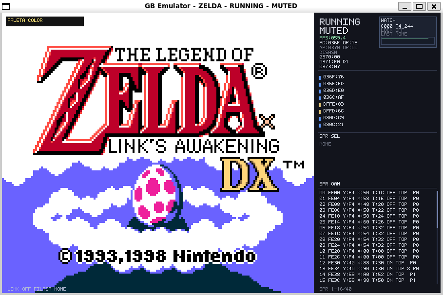

# Game Boy Emulator (C++)



Emulador de **Game Boy (DMG)** com suporte inicial a **Game Boy Color (CGB)**, escrito em C++17.
O projeto tem foco em legibilidade, arquitetura modular e ferramentas de debug em tempo real.

## Documentacao

- Guia completo: `docs/guia.md`
- Formato da suite de ROMs: `docs/rom-suite.md`

## Build

### Dependencias

- CMake 3.16+
- Compilador com C++17
- SDL2 (recomendado para frontend grafico)
- SDL2_image (opcional, para capas `.jpg/.jpeg` no seletor)

### Comandos

```bash
cmake -S . -B build -DGBEMU_USE_SDL2=ON
cmake --build build -j
```

Sem SDL2, o executavel ainda funciona em modo headless.

## Como rodar

### Fluxo padrao (SDL2)

```bash
./build/gbemu
```

Se nenhuma ROM for passada, abre o seletor grafico SDL automaticamente.

### Carregar ROM por parametro

```bash
./build/gbemu --rom caminho/para/jogo.gb
# ou
./build/gbemu caminho/para/jogo.gb

# selecionar hardware para ROM dual-mode
./build/gbemu --rom caminho/para/jogo.gb --hardware dmg
./build/gbemu --rom caminho/para/jogo.gb --hardware cgb
```

### Seletor de ROM explicitamente

```bash
./build/gbemu --choose-rom
```

### Headless

```bash
./build/gbemu --rom caminho/para/jogo.gb --headless 300
```

Gera `frame.ppm` ao final da execucao.

### Suite de compatibilidade

```bash
./build/gbemu --rom-suite roms/tests/manifest.txt
```

### Selecao de hardware (DMG/CGB)

- `--hardware auto` (padrao): usa CGB quando a ROM suporta
- `--hardware dmg`: forca modo Game Boy classico em ROM dual-mode
- `--hardware cgb`: forca modo Game Boy Color quando a ROM suporta

Regras:

- ROM CGB-only ignora `--hardware dmg`
- ROM sem suporte CGB ignora `--hardware cgb`

## Estrutura esperada de ROMs (seletor SDL)

O seletor procura primeiro em `./rom`, depois em `./roms`.
Cada jogo deve estar em uma pasta propria:

```text
rom/
  Pokemon Yellow/
    pokemon.gb
    capa.jpg
  Mario Land/
    mario.gb
    capa.jpg
```

- Nome da pasta: vira o label no card
- `.gb`/`.gbc`: ROM
- `.jpg`/`.jpeg`: imagem de preview (opcional)

## Controles principais (SDL)

### Jogo

- Setas: direcional
- `Z`: A
- `X`: B
- `Enter`: Start
- `Backspace`: Select
- `Space`: pausar/continuar
- `Tab` (segurado): fast forward
- `P`: mute/unmute
- `Esc`: sair

### Estado e execucao

- `Ctrl+S`: salvar save state
- `F5` ou `Ctrl+L`: carregar save state
- `F11`: menu de remapeamento de controles (teclado e controle)
- `F3`: mostrar/ocultar barra superior
- `L`: encerrar sessao atual e voltar ao menu de ROMs
- `Left` (pausado): voltar 1 frame
- `Right` (pausado): avancar 1 frame

### Video

- `F`: fullscreen on/off
- `N` (em fullscreen): menu de escala
  - `1`: Crisp Fit (nitido + barras laterais)
  - `2`: Full Stretch (sem barras)
  - `3`: Full Stretch Sharp (sem barras + sharpen)
- `V`: menu de paleta
  - `1`: Game Boy Classico
  - `2`: Game Boy Pocket
  - `3`: Game Boy Color (somente ROM com suporte CGB)
- `H`: alternar filtro (`None` / `Scanline` / `LCD`)
- `F9`: screenshot `.ppm` em `captures/<rom>/`

### Debug

- `I`: mostrar/ocultar painel de debug (oculto por padrao)
- `D`: mostrar/ocultar menu visual de BP/WP (oculto por padrao)
- `S`: abrir/fechar busca de memoria
- `M`: editor hexadecimal (endereco + valor)
- `[` / `]`: endereco observado -1 / +1
- `=` / `-` / `0`: incrementar / decrementar / zerar endereco observado
- `K`: lock por frame no endereco observado
- `W`: watchpoint no endereco observado
- `B`: breakpoint no `PC` atual
- Clique em leitura de memoria: fixa watch
- Clique em sprite da lista OAM: seleciona sprite + preview/overlay

## Barra superior (SDL)

Durante o jogo, uma barra no topo mostra **secoes clicaveis**:

- `SESSAO`
- `IMAGEM`
- `DEBUG`
- `CONTROLES`

Cada secao abre um dropdown com acoes (pause, mute, save/load, fullscreen, filtro, debug, etc.).

Comportamento da barra:

- itens aparecem dinamicamente quando estao disponiveis (ex.: `MENU ESCALA` somente em fullscreen)
- hover no mouse destaca secao e item
- clique executa a acao
- `F3` mostra/oculta a barra

## Fechar janelas pop-up

Menus pop-up (`Escala`, `Paleta`, `Controles`) agora exibem um botao `X` no canto superior direito:

- clique no `X` para fechar
- atalhos de teclado continuam funcionando normalmente

## Persistencia de controles

Ao alterar controles no menu `F11`, o emulador salva automaticamente para futuras sessoes:

- `states/<rom>.controls` (perfil da ROM atual)
- `states/global.controls` (fallback global)

No inicio da sessao, ele carrega primeiro o perfil da ROM; se nao existir, usa o global.

## Persistencia

Arquivos sao salvos em `./states/` por nome da ROM (`<rom>.ext`):

- `.state`: save state
- `.sav`: save interno do cartucho (battery RAM)
- `.rtc`: relogio RTC (MBC3/HuC3)
- `.palette`: preferencia de paleta
- `.filters`: preferencia de filtro

Capturas vao para `./captures/<rom>/`.

## Arquitetura do projeto

- `include/gb/core/` e `src/core/`: nucleo de emulacao
  - CPU, Bus/MMU, PPU, APU, Timer, Joypad, Cartridge, GameBoy
- `include/gb/app/` e `src/app/`: camada de aplicacao
  - parsing de argumentos, runtime paths, modo headless, suite
- `include/gb/app/frontend/` e `src/app/frontend/`: frontend SDL modular
  - `rom_selector`, `realtime`, `debug_ui`, `realtime_support`
- `tests/`: testes automatizados

## Testes

```bash
cmake -S . -B build -DBUILD_TESTING=ON
cmake --build build -j
ctest --test-dir build --output-on-failure
```

Suites por area (exemplo):

```bash
ctest --test-dir build -R gbemu_suite_cpu --output-on-failure
```
